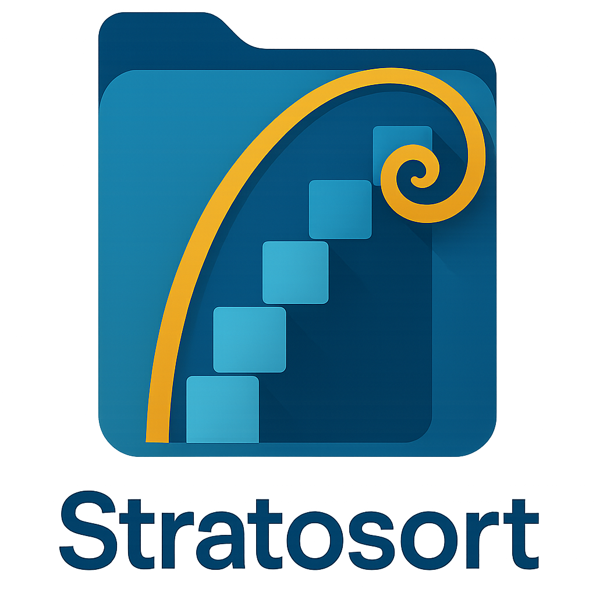

# El StratoSort

<p align="center">
  
</p>

<p align="center">
  <strong>Smart File Organization with Local AI</strong>
</p>

<p align="center">
  <a href="https://github.com/iLevyTate/elstratosort/releases"></a>
  <a href="https://github.com/iLevyTate/elstratosort/blob/main/LICENSE"></a>
  <a href="https://github.com/iLevyTate/elstratosort/actions/workflows/ci.yml"></a>
  
</p>

<p align="center">
  
  
  
  
</p>

<p align="center">
  <a href="#features">Features</a> &bull;
  <a href="#quick-start">Quick Start</a> &bull;
  <a href="#documentation">Docs</a> &bull;
  <a href="#contributing">Contributing</a> &bull;
  <a href="CHANGELOG.md">Changelog</a>
</p>

---

El StratoSort is a **privacy-first document organizer** that uses local AI to categorize and arrange
files without sending data to the cloud. All processing happens on your machine using
[Ollama](https://ollama.ai) for AI inference and [ChromaDB](https://www.trychroma.com) for semantic
search.

## What's New in v1.1.0

- **Smart Folder Watcher** - Automatically analyzes new and modified files in your configured smart
  folders
- **Enhanced Knowledge Graph** - Color-coded nodes by category, relationship tooltips explaining
  _why_ files are connected, and improved layout algorithms
- **AI Description Generation** - Generate smart folder descriptions with one click using AI
- **Undo History Navigation** - Jump to specific points in your undo history
- **Retry Failed Files** - Easily retry analysis for files that encountered errors
- **Conflict Detection** - Warnings when multiple files target the same destination

See [CHANGELOG.md](CHANGELOG.md) for full release notes.

## Features

| Feature                  | Description                                                  |
| ------------------------ | ------------------------------------------------------------ |
| **Local AI Analysis**    | Powered by Ollama - fully offline, no cloud required         |
| **Smart Organization**   | Categorizes files based on content, not just filenames       |
| **Smart Folder Watcher** | Monitors folders and analyzes new files automatically        |
| **Image Understanding**  | Analyzes visual content to categorize photos and screenshots |
| **Knowledge Graph**      | Visualize file relationships with color-coded categories     |
| **Safe Operations**      | Full undo/redo capability with history navigation            |
| **Privacy-First**        | No data exfiltration - all processing on your machine        |
| **Vector Search**        | ChromaDB-powered semantic understanding and retrieval        |

## Quick Start

### Prerequisites

- **OS**: Windows 10/11 (recommended), macOS 10.15+, or Linux
- **RAM**: 8GB+ recommended
- **Disk**: 12GB+ free space
- **Dependencies**: Python 3.9+ (for ChromaDB)

### Installation

```bash
git clone https://github.com/iLevyTate/elstratosort.git
cd elstratosort
npm ci
npm run dev
```

**First Launch:** The app will guide you through installing Ollama and downloading AI models. It
will also attempt to install ChromaDB and Tesseract OCR automatically.

> **Note:** El StratoSort is developed with a Windows-first approach. While releases are published
> for all major platforms, only the Windows build is robustly tested. macOS and Linux builds are
> provided on a best-effort basis.

For detailed setup instructions, see the **[Getting Started Guide](docs/GETTING_STARTED.md)**.

## Privacy & Security

| Principle             | Implementation                                         |
| --------------------- | ------------------------------------------------------ |
| **100% Local**        | No internet required after initial setup               |
| **No Tracking**       | Zero data collection or telemetry                      |
| **Open Source**       | Full source code available for inspection              |
| **Secure by Default** | Context isolation, input validation, path sanitization |

See [SECURITY.md](SECURITY.md) for our security policy and vulnerability reporting.

## Advanced Features

### Smart Folders

Configure keywords and descriptions for your folders. The AI learns from your selections and
improves suggestions over time.

### Auto-Organization

Enable "Watch Downloads Folder" or "Watch Smart Folders" in Settings to automatically analyze and
organize new files as they arrive.

### Batch Operations

Select multiple files or folders, analyze them together, and apply suggestions in bulk with full
undo support.

## Documentation

| Document                                       | Description                   |
| ---------------------------------------------- | ----------------------------- |
| [Getting Started](docs/GETTING_STARTED.md)     | Installation and setup guide  |
| [Architecture](docs/ARCHITECTURE.md)           | System design and data flow   |
| [Learning Guide](docs/LEARNING_GUIDE.md)       | Codebase onboarding           |
| [Testing](TESTING.md)                          | Test patterns and coverage    |
| [Code Quality](docs/CODE_QUALITY_STANDARDS.md) | Style and review standards    |
| [DI Patterns](docs/DI_PATTERNS.md)             | Dependency injection patterns |
| [Error Handling](docs/ERROR_HANDLING_GUIDE.md) | Error handling standards      |
| [IPC Contracts](docs/IPC_CONTRACTS.md)         | IPC communication specs       |

## For Developers

### Tech Stack

| Technology            | Purpose                              |
| --------------------- | ------------------------------------ |
| **Electron**          | Cross-platform desktop framework     |
| **React 19**          | UI library with Redux Toolkit        |
| **Ollama**            | Local AI inference (text and vision) |
| **ChromaDB**          | Vector database for semantic search  |
| **Tailwind CSS**      | Utility-first styling                |
| **Jest + Playwright** | Testing infrastructure               |

### Key Scripts

```bash
npm run dev            # Development mode with hot reload
npm run lint           # ESLint code quality check
npm test               # Run Jest unit/integration tests
npm run build          # Production webpack build
npm run dist:win       # Create Windows installer
npm run dist:mac       # Create macOS installer
npm run dist:linux     # Create Linux packages
npm run setup:deps     # Install Ollama + ChromaDB + Tesseract
```

### Building Installers

- **Windows (preferred)**: Run the GitHub Actions workflow "Windows Dist (Manual)" or locally with
  `npm run dist:win`
- **macOS/Linux**: Build on the target OS with `npm run dist:mac` or `npm run dist:linux`

## Contributing

We welcome contributions! Please see [CONTRIBUTING.md](CONTRIBUTING.md) for guidelines.

1. Fork the repository
2. Create a feature branch
3. Make changes and verify with `npm test`
4. Submit a Pull Request

## License

MIT License - See [LICENSE](LICENSE) for details.

---

<p align="center">
  <a href="https://github.com/iLevyTate/elstratosort">GitHub</a> &bull;
  <a href="https://github.com/iLevyTate/elstratosort/issues">Report Bug</a> &bull;
  <a href="https://github.com/iLevyTate/elstratosort/issues">Request Feature</a>
</p>

<p align="center">
  Built with <a href="https://ollama.ai">Ollama</a> and <a href="https://www.trychroma.com">ChromaDB</a>
</p>
