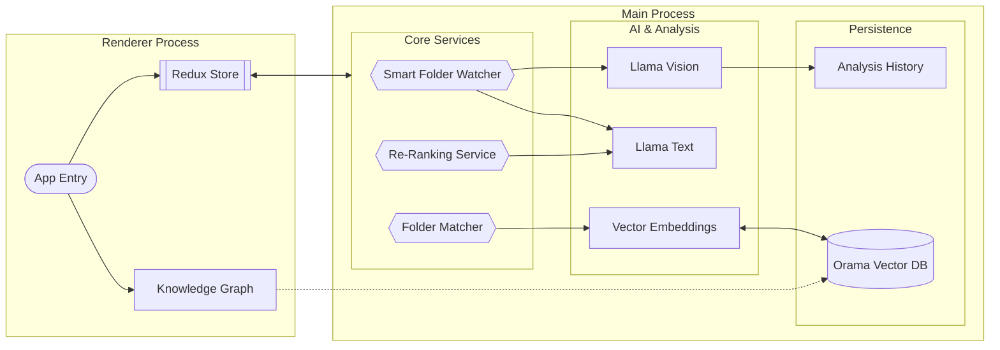

- ### Graph UX notes
  - **Bridge files**: Cross-cluster edges include a small sample of "bridge files" picked by
    similarity to opposing cluster centroids. This is best-effort and not an exhaustive list.
  - **Guide intents**: "Expand from selection" and "bridges-only" intents are supported; the
    bridges-only overlay dims non-bridge edges.
  - **Filter visibility**: Active graph filters are surfaced as chips on the graph (top-left
    overlay) and can be reset from there.

# Stratosort Architecture

## High-Level Information Flow

This diagram illustrates the flow of data through the application, highlighting the separation
between the Renderer (UI), the IPC Bridge, and the specialized in-process services.

## Key Architectural Components

### 1. Smart Folder Watcher (`SmartFolderWatcher.js`)

The watcher is the proactive heart of the system. Unlike a standard file watcher, it:

- Monitors configured paths for new/modified files.
- **Debounces** events to ensure files are fully written.
- Dispatches files to **LlamaService** (Text or Vision) for analysis.
- Automatically generates embeddings and updates **Orama Vector DB**.
- Triggers notifications and auto-organization based on confidence thresholds.

### 2. Semantic Search & Re-Ranking (`ReRankerService.js`)

Search is a two-stage pipeline that spans two services:

1.  **Retrieval** (`SearchService` / `OramaVectorService`): Fetches top candidates using hybrid
    search (vector similarity + BM25 full-text).
2.  **Re-Ranking** (`ReRankerService`): Receives the pre-ranked candidates and uses a lightweight
    LLM to score each one's relevance to the query (0-10 scale, normalized to 0-1), re-ordering them
    to bubble up the best matches.

`ReRankerService` itself does not perform retrieval -- it operates solely on candidates passed to
it.

### 3. Unified Folder Matching (`FolderMatchingService.js`)

This service acts as the bridge between raw AI analysis and your filesystem. It:

- Manages the **Orama** connection.
- Generates embeddings for file content.
- Matches new files against existing folder "clusters" to suggest destinations.
- Handles deduplication of requests to prevent overloading the local AI.

### 4. Knowledge Graph Visualization

The Knowledge Graph is a visual representation of your vector database.

- **Nodes**: Represent files, clusters, or search queries.
- **Edges**: Represent semantic similarity (distance in vector space).
- **Implementation**: Built with `React Flow` in the renderer, fetching live node data from the main
  process via IPC.

### 5. Service Container (`ServiceContainer.js`)

The DI container that owns the lifecycle of every backend service:

- **Registration**: Factory-based with three lifetimes -- `singleton`, `transient`, and `instance`
  (pre-created objects registered as singletons).
- **Resolution**: Async resolution with in-flight deduplication (prevents duplicate initialization
  of the same singleton). Circular dependency detection works for both synchronous `resolve()` (via
  shared resolution stack) and `resolveAsync()` (via `AsyncLocalStorage` per-chain tracking).
- **Shutdown ordering**: Deterministic teardown defined in `SHUTDOWN_ORDER` -- watchers first, then
  AI services (VisionService, LlamaService, OramaVector), then settings last.

### 6. Startup Manager (`StartupManagerCore.js`)

Orchestrates the boot sequence with progress reporting to the splash screen:

- **5 phases**: Migration (5-10%) -> Services (15-65%) -> Models (70-75%) -> App Services (85%) ->
  Ready (100%).
- **Timeout**: 60s default (`startupTimeout`), enforced via `AbortController` -- every phase checks
  `signal.aborted` before proceeding.
- **Health monitoring**: After startup completes, a 2-minute interval polls service health.

### 7. IPC Handlers (`src/main/ipc/`)

19 handler modules organized by domain:

- **Top-level** (15): `analysis`, `analysisHistory`, `chat`, `files`, `knowledge`, `llama`,
  `organize`, `semantic`, `settings`, `smartFolders`, `suggestions`, `system`, `undoRedo`,
  `vectordb`, `window`.
- **Files subdirectory** (4): `fileOperationHandlers`, `fileSelectionHandlers`, `folderHandlers`,
  `shellHandlers`.
- **`IpcServiceContext`**: Groups service dependencies into a single context object, replacing
  28-parameter function signatures.
- **`ipcWrappers`**: Composable middleware (`withErrorLogging`, `withValidation`,
  `withServiceCheck`) and a unified `createHandler` factory.

### 8. AI & Analysis

#### LlamaService (`LlamaService.js`)

In-process GGUF inference via node-llama-cpp. Three model types: text (Mistral 7B Q4), vision
(config/coordination only, delegates to VisionService), embedding (nomic-embed Q8_0 768d). GPU
auto-detection (CUDA -> Vulkan -> Metal -> CPU), lazy loading via ModelMemoryManager (LRU eviction,
70% RAM budget).

#### VisionService (`VisionService.js`)

External llama-server process (separate binary, downloads from GitHub releases). OpenAI-compatible
`/v1/chat/completions` API, 120s per-image timeout, health check polling.

#### Document Extractors (`src/main/analysis/documentExtractors.js`)

PDF (unpdf + OCR fallback), DOCX (mammoth), XLSX (xlsx-populate), PPTX (officeparser), CSV, plain
text. OCR: Tesseract.js with Sharp rasterization, max 3 PDF pages / 10 office images. Memory limits:
100MB file cap, 500k char output, streaming for >50MB files.

#### Concurrency & Resilience

- **ModelAccessCoordinator**: per-type load queues (mutex), inference queue (1-4 concurrent, 100
  max)
- **LlamaResilience**: per-model-type circuit breaker (5-failure threshold, 30s recovery), 3 retries
  with exponential backoff, GPU->CPU fallback
- **ModelMemoryManager**: LRU eviction, OOM prevention, estimates per model type
- **DegradationManager**: system readiness checks, determines recovery actions

#### Model Download (`ModelDownloadManager.js`)

Resume support (`.partial` + Range headers), SHA-256 verification, disk space checks. Auto-downloads
companion files (vision projectors), model catalog in `src/shared/modelRegistry.js`.

#### Embedding Pipeline

- **ParallelEmbeddingService**: semaphore-based concurrency (CPU-adaptive, max 10), dynamic
  adjustment on error rate
- **embeddingQueue/**: separate stage queues for files vs folders, batch upsert with individual
  fallback

## Renderer / UI Layer

### Entry & Routing

**Entry:** `src/renderer/index.js` (React 19 + `createRoot`, prefetches docs path / redact paths /
smart folders / settings).

Phase-based routing via `PhaseRenderer.jsx` (no React Router): WELCOME -> SETUP -> DISCOVER ->
ORGANIZE -> COMPLETE

Each phase lazy-loaded with `React.lazy()` + `Suspense`, wrapped in `PhaseErrorBoundary`.

### Redux Store (4 slices)

| Slice           | Responsibility                                              |
| :-------------- | :---------------------------------------------------------- |
| `uiSlice`       | Phase management, loading flags, settings cache, modals     |
| `filesSlice`    | File selection, smart folders, organization history, naming |
| `analysisSlice` | Analysis progress, results (max 5000), embedding state      |
| `systemSlice`   | CPU/memory metrics, service health, notifications, paths    |

**Middleware:** `ipcMiddleware` (event queue + Zod validation), `persistenceMiddleware` (1s
debounce, quota-aware degradation).

### Knowledge Graph (`UnifiedSearchModal.jsx`, ~7400 lines)

React Flow with ELK layout, max 300 nodes.

- **4 node types:** file, folder, query, cluster
- **4 edge types:** similarity, queryMatch, smartStep, knowledge
- **Features:** Multi-hop discovery, drag-and-drop, keyboard nav, chat panel, cluster legend, guided
  tour

### Component Groups

| Directory   | Contents                                  |
| :---------- | :---------------------------------------- |
| `discover/` | Drag-drop zone, analysis progress         |
| `organize/` | Suggestions, virtualized grids            |
| `search/`   | Graph, chat panel, autocomplete           |
| `settings/` | Model selection, embedding rebuild        |
| `setup/`    | Smart folder management (add/edit modals) |
| `ui/`       | Design system (Button, Card, Modal, etc.) |
| `icons/`    | Icon components                           |
| `layout/`   | AppShell, ActionBar                       |

Root-level components include `PhaseRenderer`, `NavigationBar`, `SettingsPanel`, `ModelSetupWizard`,
Toast system, and error boundaries.

### IPC Bridge (`src/preload/preload.js`)

Rate-limited (200 req/s), sanitized, channel-whitelisted, 30s-300s timeouts, retry with exponential
backoff.

## Data Flow & Caching

### Analysis Caching

To respect local resources, we use a multi-tiered caching strategy:

- **`AnalysisCacheService`**: Uses LRU caching for expensive AI responses (vision/text analysis).
- **`AnalysisHistory`**: Persisted log of all past analyses to prevent re-processing unchanged
  files.
- **`GlobalDeduplicator`**: Prevents identical requests (e.g., same image analyzed twice in quick
  succession) from hitting the LLM.

### In-Flight Deduplication

We maintain separate queues to manage different types of bottlenecks:

- **LLM Queue**: Limits concurrent heavy AI tasks (via `ModelAccessCoordinator`).
- **DB Queue**: Manages read/write locks for Orama.

## Code Standards

For information on coding patterns, error handling, and dependency injection, refer to the other
documentation files:

- [CODE_QUALITY_STANDARDS.md](CODE_QUALITY_STANDARDS.md)
- [DI_PATTERNS.md](DI_PATTERNS.md)
- [ERROR_HANDLING_GUIDE.md](ERROR_HANDLING_GUIDE.md)
