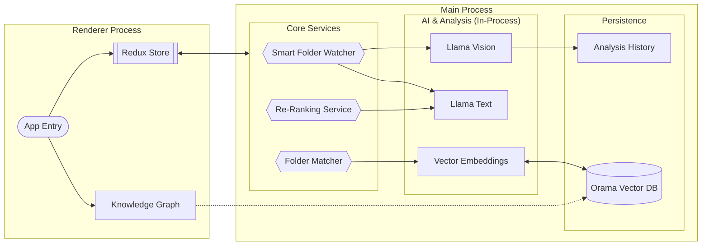

- ### Graph UX notes
  - **Bridge files**: Cross-cluster edges include a small sample of "bridge files" picked by
    similarity to opposing cluster centroids. This is best-effort and not an exhaustive list.
  - **Guide intents**: "Expand from selection" and "bridges-only" intents are supported; the
    bridges-only overlay dims non-bridge edges.
  - **Filter visibility**: Active graph filters are surfaced as chips on the graph (top-left
    overlay) and can be reset from there.

# Stratosort Architecture

## High-Level Information Flow

This diagram illustrates the flow of data through the application, highlighting the separation
between the Renderer (UI), the IPC Bridge, and the specialized in-process services.

## Key Architectural Components

### 1. Smart Folder Watcher (`SmartFolderWatcher.js`)

The watcher is the proactive heart of the system. Unlike a standard file watcher, it:

- Monitors configured paths for new/modified files.
- **Debounces** events to ensure files are fully written.
- Dispatches files to **LlamaService** (Text or Vision) for analysis.
- Automatically generates embeddings and updates **Orama Vector DB**.
- Triggers notifications and auto-organization based on confidence thresholds.

### 2. Semantic Search & Re-Ranking (`ReRankerService.js`)

Search is a two-stage pipeline designed for accuracy:

1.  **Retrieval**: Orama fetches top candidates using vector similarity.
2.  **Re-Ranking**: The `ReRankerService` uses a lightweight LLM to evaluate the specific relevance
    of each candidate to the user's query, re-ordering them to bubble up the best matches.

### 3. Unified Folder Matching (`FolderMatchingService.js`)

This service acts as the bridge between raw AI analysis and your filesystem. It:

- Manages the **Orama** connection.
- Generates embeddings for file content.
- Matches new files against existing folder "clusters" to suggest destinations.
- Handling deduplication of requests to prevent overloading the local AI.

### 4. Knowledge Graph Visualization

The Knowledge Graph is a visual representation of your vector database.

- **Nodes**: Represent files, clusters, or search queries.
- **Edges**: Represent semantic similarity (distance in vector space).
- **Implementation**: Built with `React Flow` in the renderer, fetching live node data from the main
  process via IPC.

## Data Flow & Caching

### Analysis Caching

To respect local resources, we use a multi-tiered caching strategy:

- **`AnalysisCacheService`**: Uses LRU caching for expensive AI responses (vision/text analysis).
- **`AnalysisHistory`**: Persisted log of all past analyses to prevent re-processing unchanged
  files.
- **`GlobalDeduplicator`**: Prevents identical requests (e.g., same image analyzed twice in quick
  succession) from hitting the LLM.

### In-Flight Deduplication

We maintain separate queues to manage different types of bottlenecks:

- **LLM Queue**: Limits concurrent heavy AI tasks (via `ModelAccessCoordinator`).
- **DB Queue**: Manages read/write locks for Orama.

## Code Standards

For information on coding patterns, error handling, and dependency injection, refer to the other
documentation files:

- [CODE_QUALITY_STANDARDS.md](CODE_QUALITY_STANDARDS.md)
- [DI_PATTERNS.md](DI_PATTERNS.md)
- [ERROR_HANDLING_GUIDE.md](ERROR_HANDLING_GUIDE.md)
