# Stratosort Architecture

## High-Level Information Flow

This diagram illustrates the flow of data and control through the application. It emphasizes the
separation between the Renderer (UI), the IPC Bridge, and the Main Process (Backend), with a focus
on the file organization pipeline.

```mermaid
graph LR
    %% --- Styling & Theme ---
    %% Soft, modern palette
    classDef frontend fill:#e3f2fd,stroke:#1565c0,stroke-width:2px,color:#0d47a1,rx:10,ry:10
    classDef backend fill:#f1f8e9,stroke:#33691e,stroke-width:2px,color:#33691e,rx:10,ry:10
    classDef core fill:#eceff1,stroke:#455a64,stroke-width:2px,color:#455a64,rx:10,ry:10
    classDef data fill:#fff3e0,stroke:#e65100,stroke-width:2px,shape:cylinder,color:#e65100
    classDef ai fill:#f3e5f5,stroke:#7b1fa2,stroke-width:2px,color:#4a148c,rx:10,ry:10
    classDef ipc fill:#fafafa,stroke:#333,stroke-width:2px,stroke-dasharray: 5 5,color:#333,rx:15,ry:15
    classDef process fill:#e0f2f1,stroke:#00695c,stroke-width:2px,color:#00695c,shape:hexagon

    %% --- 1. FRONTEND (User Interaction) ---
    subgraph UI_Layer ["🖥️ Renderer Process"]
        direction TB
        AppEntry([App Entry])
        ReduxStore[[Redux Store]]
        ViewMgr("Phase Renderer")

        AppEntry --> ReduxStore
        AppEntry --> ViewMgr
    end

    %% --- 2. BRIDGE (Communication) ---
    subgraph IPC_Bridge ["⚡ IPC Communication"]
        direction TB
        IPC_Hub(("IPC Hub"))
    end

    %% --- 3. BACKEND (Logic & Processing) ---
    subgraph Main_Process ["⚙️ Main Process"]
        direction LR

        %% Lifecycle Management (Top)
        subgraph Lifecycle ["Lifecycle & DI"]
        direction TB
            Main([Main Entry])
            Services{Service Container}
            Main ==> Services
        end

        %% The Core Organization Pipeline (Middle - Horizontal Flow)
        subgraph Pipeline ["📂 Organization Pipeline"]
            direction LR
            Watcher{{Download Watcher}}
            AutoOrg{{Auto Organizer}}
            Suggester{{Suggestion Engine}}
            Matcher{{Folder Matcher}}

            Watcher --> AutoOrg
            AutoOrg --> Suggester
            Suggester --> Matcher
        end

        %% Intelligence & Analysis (Bottom)
        subgraph Intelligence ["🧠 AI & Analysis"]
            direction TB
            DocAnalysis("File Analysis")
            Embeddings("Embeddings")
            Ollama("Ollama LLM")

            DocAnalysis -.-> Ollama
            Embeddings -.-> Ollama
        end

        %% Persistence (Far Right)
        subgraph Persistence ["💾 Data Store"]
            direction TB
            ChromaDB[(ChromaDB)]
            Settings("Settings JSON")
            ProcessingState("State Tracker")
        end
    end

    %% --- CONNECTIONS & FLOW ---

    %% Frontend <-> IPC <-> Backend
    ReduxStore <==> IPC_Hub
    IPC_Hub <==> Services

    %% Pipeline Logic Flow
    Services -.->|Injects| Pipeline
    Services -.->|Injects| Intelligence

    %% Detailed Data Flow
    Matcher --> Embeddings
    Embeddings <--> ChromaDB

    %% State Updates
    AutoOrg -.->|Update Status| ProcessingState
    ProcessingState -.->|Emit Event| IPC_Hub

    %% Settings Impact
    Settings -.->|Configures| Pipeline
    Settings -.->|Configures| Intelligence

    %% --- CLASS ASSIGNMENTS ---
    class AppEntry,ReduxStore,ViewMgr frontend
    class IPC_Hub ipc
    class Main,Services,ProcessingState core
    class Watcher,AutoOrg,Suggester,Matcher,DocAnalysis process
    class Ollama,Embeddings ai
    class ChromaDB,Settings data
```

## Code Consolidation & Architecture Decisions

### In-flight Deduplication

We maintain three separate in-flight deduplication mechanisms because they serve distinct domains
with different lifecycles:

1. **`LLMRequestDeduplicator`**: Handles global LLM call deduplication (expensive, long-running).
2. **`ChromaDBServiceCore.inflightQueries`**: Handles DB query deduplication with stale cleanup
   (IO-bound).
3. **`ReRankerService._inFlightRequests`**: Handles scoring request deduplication (CPU-bound).

Separation allows for tailored cleanup strategies and prevents cross-domain contention.

### Analysis Caching Strategy

- **`AnalysisCacheService`**: Uses `LRUCache` (via shared singleton) for text/image analysis
  results.
- **`AnalysisHistoryCache`**: Uses manual `Map` management instead of `LRUCache`. This is
  intentional because:
  - It handles multiple cache types with different semantics (single-value vs LRU).
  - It requires fine-grained invalidation specific to analysis history UI needs.
  - It tracks incremental statistics that don't map well to a simple LRU eviction policy.

### Folder Matching Harmonization

Two systems exist for categorization, serving complementary purposes:

- **`FolderMatchingService.matchCategoryToFolder()`**: Normalizes LLM output to match existing
  folder names exactly.
- **`fallbackUtils.getIntelligentCategory()`**: Infers category from filename/extension when no AI
  is available.

These are kept separate to ensure a clear fallback chain:
`LLM -> Folder Matcher -> Fallback Heuristics`.
